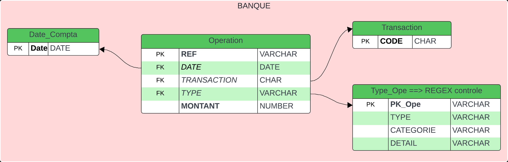

## HB_SQL Project

This project aims to create a Python/SQL application for financial data management and analysis. It includes the creation of conceptual, logical, and physical data models, setting up SQLDeveloper databases, inserting data from a CSV file, and implementing a Python Tkinter interface to answer specific questions.

---

## Project Structure

```
- IMAGE/
  - Bank_Diagram.png
- SQL_DATA/
  - balance-2020.csv
  - DWH_Create_Table.sql
  - DWH_Insert.sql
  - ODS_Create_Banque.sql
  - ODS_Insert_Banque.sql
- view.py
- sql_request.py
- requirements.txt
```

---

## Usage

### Data Modeling:

Conceptual, logical, and physical like:



### Database Setup:

- Execute `ODS_Create_Banque.sql` in SQLDeveloper to create the ODS database table.
- Execute `ODS_Insert_Banque.sql` to insert data from `balance-2020.csv` into the ODS database.
- Execute `DWH_Create_Table.sql` in SQLDeveloper to create the DWH database table.
- Execute `DWH_Insert.sql` to insert data from the ODS database table into the DWH database.

### Tkinter Interface:

- Run `view.py` to launch the Tkinter interface.
    Who Answer the following questions:
    - What is the biggest expense category?
    - What is the largest revenue source subcategory?
    - How has the customer balance changed over time?

---

## Installation

1. Clone the repository:

   ```bash
   git clone https://github.com/RolhaxJV/HB_SQL.git
   cd HB_SQL
   ```

2. Install required Python packages:

   ```bash
   pip install -r requirements.txt
   ```

---

## Contributing

If you would like to contribute to this project, please follow these steps:

1. Fork the repository.
2. Create a new branch (`git checkout -b feature/new-feature`).
3. Make your changes.
4. Commit your changes (`git commit -am 'Add new feature'`).
5. Push to the branch (`git push origin feature/new-feature`).
6. Create a new Pull Request.

---

## Credits

This project was created by Vomiandry Jolhan.

---

## License

MIT License

See [LICENSE](LICENSE) for more information.

